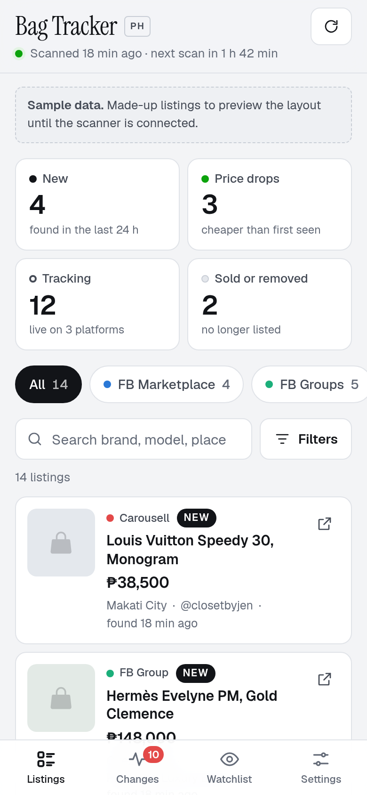
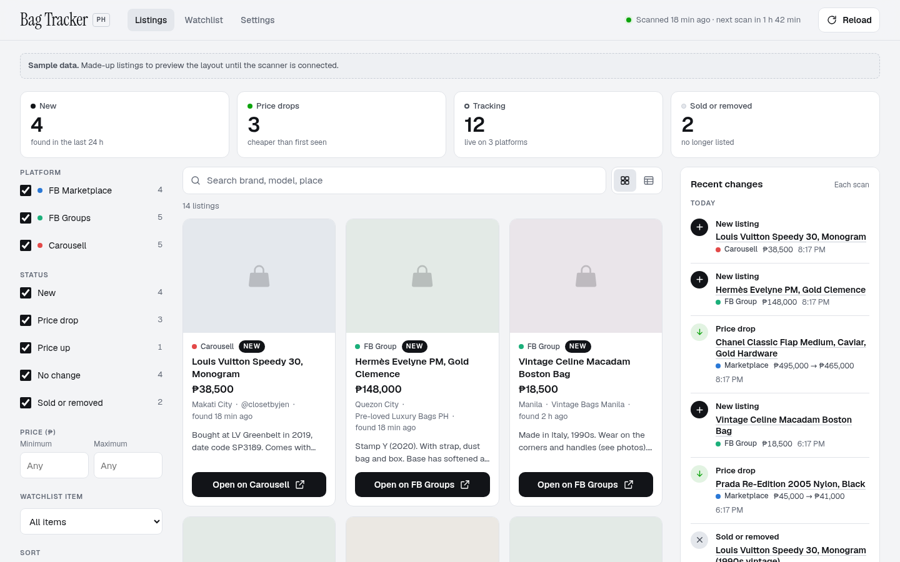

# Listing-tracker

A dashboard that tracks luxury and vintage bag listings in the **Philippines** on
**Facebook Marketplace**, **Facebook groups** and **Carousell**. Every listing links
straight to the original post and shows its price, description and platform. Scans
run every 1 to 4 hours, and new or changed listings will trigger a Gmail alert.

> **Status:** the dashboard layout is done and runs on **sample data**. The scanner
> (the part that actually finds listings) and the Gmail alerts are the next steps.

| Phone | Desktop |
| --- | --- |
|  |  |

## What the dashboard shows

- **Scan status** at the top: when the last scan ran and when the next one is due (Philippine time).
- **Summary tiles**: new listings, price drops, listings being tracked, and sold or removed items. Tap a tile to filter by it.
- **Listings**, each with a platform label (Marketplace, FB Group, Carousell), a status tag (New, a price drop %, a price increase %, Sold or removed), the price with the old price crossed out if it changed, location, seller or group, and an **Open** link to the original listing.
- **Filters**: platform, status, price range, watchlist item, sort order and a search box.
- **Changes**: a timeline of everything each scan found or noticed changing.
- **Watchlist**: the bags being searched for.
- **Settings**: scan schedule, per-platform scan health, email alert rules and a preview of the alert email.

On a **phone** the listings are compact rows (tap a row for the full description and the
Open button), and a tab bar at the bottom switches between Listings, Changes, Watchlist and
Settings. On a **desktop** the filters sit in a left sidebar, listings show as photo cards
(or a table), and recent changes stay visible on the right. The page follows the device's
light or dark mode.

## Folder guide

```
listing-tracker/
├── index.html                 dashboard page
├── assets/
│   ├── styles.css             look and layout (phone, tablet, desktop, light and dark)
│   └── app.js                 loads the data and draws everything; re-checks data every 5 min
├── config/                    ← files you edit
│   ├── watchlist.json         the bags to track (examples for now)
│   └── settings.json          scan interval (1–4 h), Gmail address, which changes send an email
├── data/                      ← files the scanner writes
│   └── listings.json          listings + change events (sample data for now)
├── docs/screenshots/          phone and desktop previews used above
│
├── scanner/                   (next step) the bot that finds listings
│   ├── run.js                 load config → scan each platform → compare → save → email
│   ├── sources/               carousell.js, fb-marketplace.js, fb-groups.js
│   ├── diff.js                spots new listings, price changes and removed listings
│   └── notify-gmail.js        sends one summary email per scan
└── .github/workflows/scan.yml (next step) runs the scanner on a schedule
```

The dashboard only **reads** `config/` and `data/`, so adding the scanner later doesn't
change the dashboard.

## Data format (`data/listings.json`)

```jsonc
{
  "lastScan": "2026-09-26T02:42:00Z",      // ISO time of the last scan
  "nextScan": "2026-09-26T04:42:00Z",
  "sources": [{ "platform": "carousell", "ok": true, "found": 4 }],
  "listings": [{
    "id": "carousell-1001",
    "platform": "carousell",                 // fb_marketplace | fb_group | carousell
    "source": "Carousell",                   // group name for fb_group
    "title": "Louis Vuitton Speedy 30, Monogram",
    "price": 38500, "previousPrice": null, "currency": "PHP",
    "condition": "Lightly used",
    "description": "…",
    "location": "Makati City", "seller": "@closetbyjen",
    "url": "https://…",                      // direct link to the listing
    "image": null,                           // photo URL, if available
    "firstSeen": "…", "lastSeen": "…",
    "status": "new",                         // new | price_drop | price_up | unchanged | removed
    "matchedQuery": "Louis Vuitton Speedy 30"
  }],
  "events": [{ "type": "price_drop", "listingId": "…", "at": "…", "from": 495000, "to": 465000 }]
}
```

When `"sample": true` is set, the page shifts the sample times so the last scan always looks recent.

## Preview it yourself

Browsers block data files on pages opened straight from disk, so serve the folder:

```bash
python3 -m http.server 8000
# then open http://localhost:8000
```

Or turn on **GitHub Pages** (Settings → Pages → deploy from branch) once this is merged to `main`.

## Next steps

1. **Watchlist:** send the bags you want tracked (brand, model, size, colour, price range).
2. **Scanner:** Carousell PH search pages can be read with a headless browser. Facebook
   Marketplace and groups need a logged-in account, and Facebook's terms forbid automated
   scraping, so choose between a paid scraping service (for example Apify) and a script
   running on your own computer with your login (which risks an account ban).
3. **Schedule:** a GitHub Actions job every 1–4 hours runs the scanner and saves `data/listings.json`.
4. **Gmail alerts:** a dedicated Gmail account with an App Password, stored as a GitHub secret.
